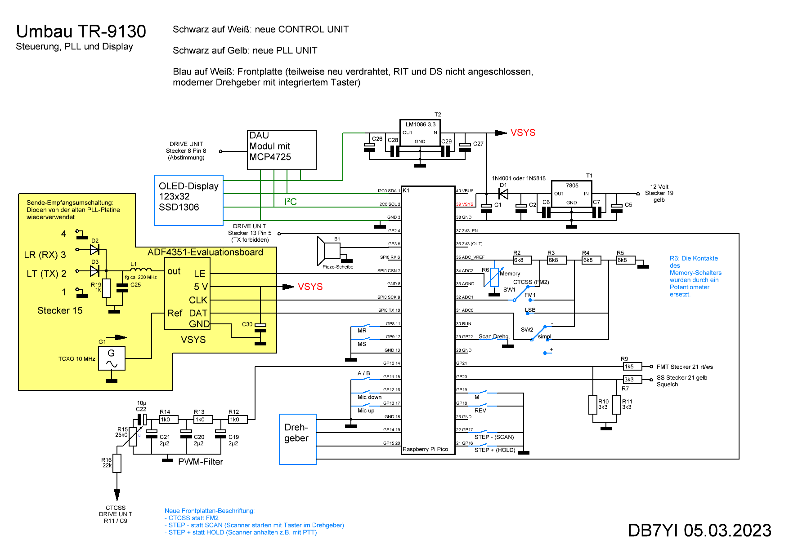

# tr-pll
Modifications for the transceiver Kenwood TR-9130:
* new control board with a Raspberry Pi Pico
* OLED display
* new PLL with TCXO, step size 10 Hz
* send CTCSS
* memory channels without backup battery

## Circuit diagram with notes in German

## Installation on a Raspberry Pi Pico
1. Follow the instructions on https://projects.raspberrypi.org/en/projects/getting-started-with-the-pico to learn how to load the MicroPython firmware and Micropython code on a Raspberry Pi Pico.
2. Upload all files from this repository that end with .py on the pico.
