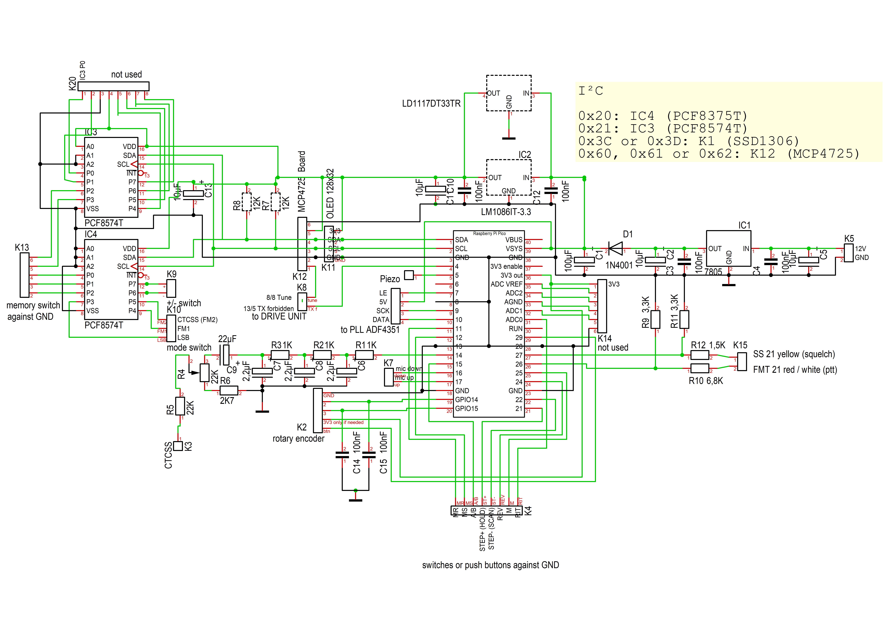

## Modifications for the transceiver Kenwood TR-9130
* new control board with a Raspberry Pi Pico
* OLED display
* new PLL with TCXO, step size 10 Hz
* CTCSS encoder
* 100 memory channels without backup battery

## Circuit diagrams with notes in German
### CONTROL UNIT

### PLL UNIT

## Changes compared to the original user manual
### Memory channels
* The memory channels are selected with the main dial.
* Special memory channels, selected with the memory switch:
  * 1 Scanner start frequency
  * 2 Scanner stop frequency
  * 3 to 5 not used (the same as 6 at the moment)
  * 6 normal operation
    
The relay shift and a possibly set sub-tone are also saved. The switches for shift and CTCSS are irrelevant in memory mode (MR switch on).
### Save and delete memory channels
Press the M button when in memory mode (MR switched on) and follow the instructions in the display.

### Step size
Decrease and increase the step size with the former scan and hold buttons.

### Scanner
Use the rotary encoder button to start and stop the scanner in vfo or memory mode. It can also be stopped with the ptt button.

### No RIT
The RIT is not supported.

### CTCSS encoder
Set the mode switch to FM1 to switch on the CTCSS encoder. You can use the main dial to set the sub-tone frequency.

### Unused contols
* RIT rotary knob and switch
* DS switch
* MS pushbutton

## Installation
* Connect your Raspberry Pi Pico to the PC while holding down the BOOTSEL button.
* The Pico should appear as a mass storage device. Copy the tr-pll.uf2 file from the latest release to it.
  
## OPTIONAL (notes in German)

